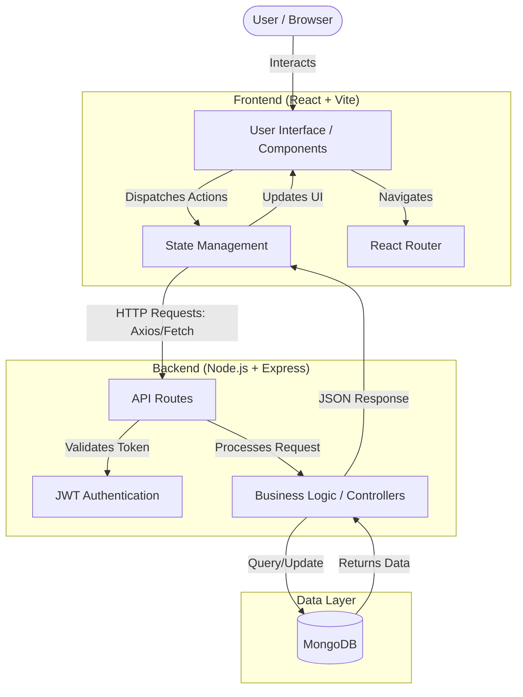
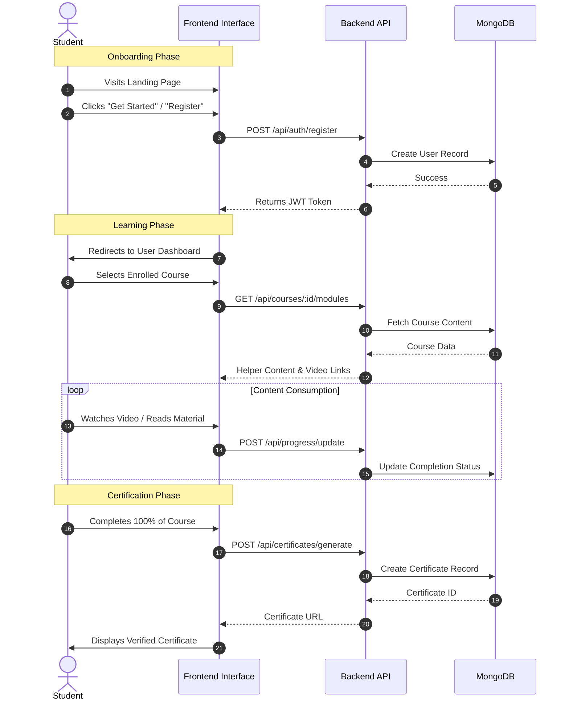

# LMS Platform - Advanced Learning Management System

## 🚀 Overview

This project is a comprehensive **Learning Management System (LMS)** designed to provide a seamless educational experience for students and a powerful management interface for administrators. It features a modern, responsive frontend built with **React & TypeScript** and a robust backend powered by **Node.js, Express, and MongoDB**.

---

## 🏗️ High-Level Architecture

The application follows a **Client-Server Architecture** (MERN Stack). Below is the high-level architecture diagram:



---

## 🔄 User Workflow

The following diagram illustrates the typical user journey from visiting the landing page to earning a certificate:



---

## 🌟 Key Features

### 🎨 Frontend
-   **Dynamic Landing Page**: Engaging UI with testimonials, course highlights, and statistics.
-   **Top-Tier Performance**: Optimized with Vite, lazy loading, and async image decoding.
-   **User Dashboard**:
    -   Track course progress.
    -   View enrolled courses.
    -   Access certificates.
-   **Course Interface**:
    -   Interactive module viewer.
    -   Video playback and resource downloads.
-   **Admin Dashboard**:
    -   Manage users and courses.
    -   View platform analytics.
-   **AI Chatbot**: Integrated assistant for student queries.
-   **Certificate Verification**: Publicly verifiable certificates via unique IDs.

### ⚙️ Backend
-   **Secure Authentication**: JWT-based login and registration.
-   **Role-Based Access Control (RBAC)**: Distinctions between Students and Admins.
-   **Course Management**: APIs to CRUD courses, modules, and lessons.
-   **Progress Tracking**: endpoints to update and retrieve user progress.
-   **Certificate Generation**: Logic to issue certificates upon course completion.

---

## 🛠️ Tech Stack

### Frontend
-   **Framework**: React 18 (Vite)
-   **Language**: TypeScript
-   **Styling**: Tailwind CSS
-   **Icons**: Lucide React
-   **Routing**: React Router DOM
-   **State Management**: React Hooks (useState, useEffect, useContext)

### Backend
-   **Runtime**: Node.js
-   **Framework**: Express.js
-   **Language**: TypeScript
-   **Database**: MongoDB (Mongoose ODM)
-   **Auth**: JSON Web Tokens (JWT), Bcrypt

---

## 📂 Project Structure

### Frontend (`/frontend`)
```
src/
├── components/          # Reusable UI components
│   ├── LandingPage.tsx  # Main marketing page
│   ├── Dashboard.tsx    # Student area
│   ├── AdminDashboard.tsx # Admin controls
│   ├── CoursePage.tsx   # Course content player
│   └── Certificate.tsx  # Certificate view
├── assets/             # Static assets (images, logos)
├── translations.ts     # Multi-language support
├── App.tsx             # Main application component & Routing
└── main.tsx            # Entry point
```

### Backend (`/backend`)
```
src/
├── models/             # Mongoose schemas (User, Course, Order)
├── routes/             # API Route definitions
├── data/               # Seed data for initialization
├── index.ts            # Server entry point
└── create_admin.ts     # Script to seed admin user
```

---

## 📦 Setup Instructions

### Prerequisites
-   Node.js (v18+)
-   MongoDB (Local or Atlas)
-   Git

### 1. Clone the Repositories
```bash
# Frontend
git clone https://github.com/RaJM2004/LMS_frontend.git
cd LMS_frontend

# Backend (in a separate terminal/folder)
git clone https://github.com/RaJM2004/LMS_backend.git
cd LMS_backend
```

### 2. Frontend Setup
```bash
cd LMS_frontend
npm install
npm run dev
# The app will run at http://localhost:5173
```

### 3. Backend Setup
```bash
cd LMS_backend
npm install
# Configure .env file (MONGO_URI, JWT_SECRET, PORT)
npm run dev
# The server will run at http://localhost:5000 (or configured port)
```

---

## 🔗 Repository Links

-   **Frontend**: [https://github.com/RaJM2004/LMS_frontend.git](https://github.com/RaJM2004/LMS_frontend.git)
-   **Backend**: [https://github.com/RaJM2004/LMS_backend.git](https://github.com/RaJM2004/LMS_backend.git)
